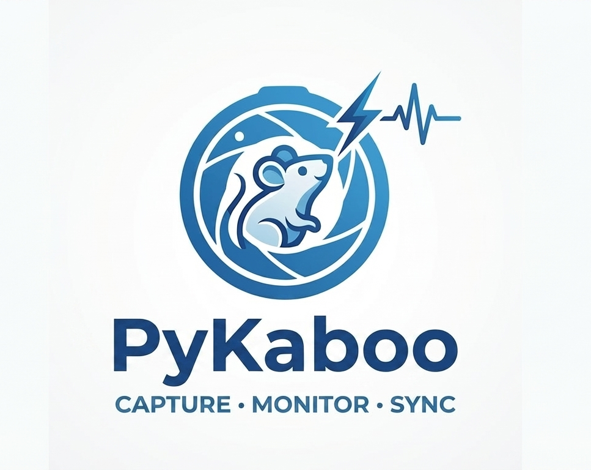

# PyKaboo

<p align="center">
  
</p>

PyKaboo is a Windows desktop app for synchronized camera acquisition, planner-driven recording, live animal detection, and Arduino TTL control. It supports Basler, FLIR, and USB cameras from one interface and keeps the recording workflow tied to a multi-trial session plan.

## Highlights

- Planner-first workflow with trial rows that drive filename, metadata, and recording duration
- Automatic restore of the last planner at startup, including the selected trial
- Auto-advance to the next pending trial when a recording finishes
- Trial row tools for duplicate, copy, paste, move up, and move down
- Live view with optional ROI cropping and frame-drop monitoring
- Live detection panel for RF-DETR Seg and YOLO Seg checkpoints
- Arduino TTL outputs, barcode/sync generation, and live behavior plots
- Recording to MP4 with synchronized metadata exports

## A Quick Tour

PyKaboo is built so the operator can stay in one place while moving from setup to acquisition: connect hardware, prepare a trial plan, monitor the live stream, and record with metadata and TTL outputs already aligned.

<p align="center">
  
  
</p>

<p align="center">
  
  
</p>

<p align="center">
  
</p>

These views show the app as it is actually used during a session: the trial planner remains central, recording metadata stays visible, and live controls for camera, detection, and Arduino outputs stay close enough to adjust without leaving the acquisition context.

## Requirements

- Windows 10 or Windows 11
- Python 3.10 recommended
- `ffmpeg` available on `PATH`
- Camera SDKs when using vendor hardware:
- Basler: Pylon SDK plus `pypylon`
- FLIR machine vision: Spinnaker SDK plus `PySpin`
- FLIR thermal: `flirpy`

## Install

Conda:

```powershell
conda env create -f environment.yaml
conda activate CamApp
```

Virtual environment:

```powershell
python -m venv .venv
.\.venv\Scripts\activate
python -m pip install --upgrade pip
python -m pip install -r requirements.txt
```

## Run

```powershell
python main.py
```

On Windows, prefer:

```bat
run_pykaboo.bat
```

The launcher looks for a Python runtime that can import `PySide6`, `cv2`, and
`PySpin`, which avoids FLIR cameras disappearing when the app is started from
the wrong interpreter in an IDE or shell.

## Planner Workflow

- Import a CSV plan or build rows directly in the Recording Planner
- The current planner is saved automatically and restored on the next launch
- Select a row to load its metadata into the session form
- Use `Ctrl+C` and `Ctrl+V` on planner row selections to copy trial content onto other rows
- Right click planner rows for duplicate, copy, paste, move up, move down, apply, and remove actions
- When a trial finishes recording, PyKaboo marks it as `Acquired` and selects the next pending row

## Outputs

Each recording can produce:

- `<name>.mp4`
- `<name>_metadata.csv`
- `<name>_metadata.json`
- `<name>_metadata.txt`
- `<name>_ttl_states.csv`
- `<name>_ttl_counts.csv`
- `<name>_behavior_summary.csv`

## Arduino Setup

PyKaboo supports:

- `StandardFirmata` for generic TTL monitoring and output control
- `StandardFirmataBarcode` for the custom barcode/sync workflow included in [StandardFirmataBarcode](StandardFirmataBarcode)

## Build A Windows EXE

The repo includes:

- [camApp-live-detection.spec](camApp-live-detection.spec)
- [scripts/build_release.ps1](scripts/build_release.ps1)

Example:

```powershell
python -m pip install -r requirements.txt pyinstaller
.\scripts\build_release.ps1 -Version v2026.04.12 -PythonExe python -Clean
```

## Troubleshooting

- `ffmpeg` not found: add FFmpeg to `PATH` and restart the shell
- `PySpin` import errors: use a Spinnaker-compatible wheel and keep `numpy<2`
- No live inference output: verify the checkpoint path and required ML packages are installed
- Vendor camera connection issues: confirm the camera opens in the vendor SDK viewer first
