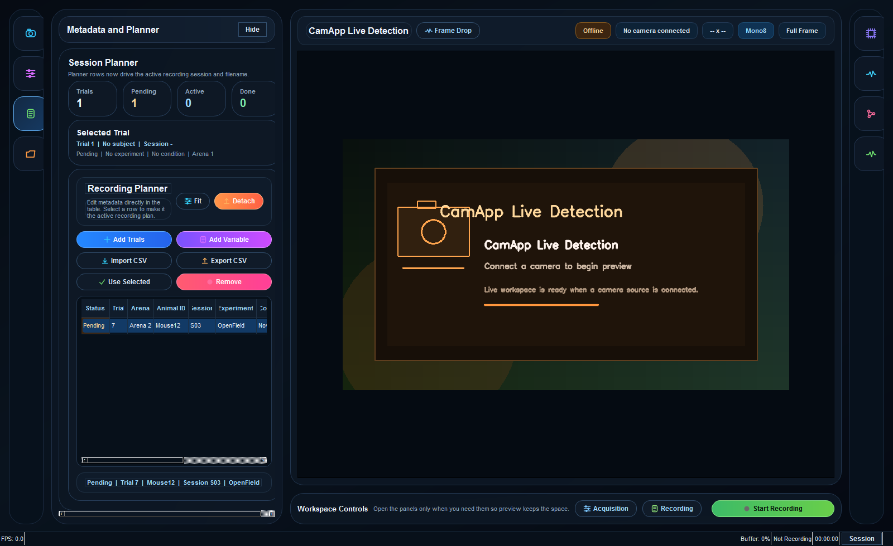
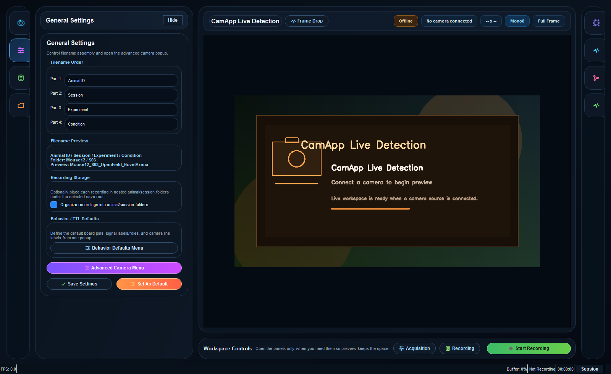
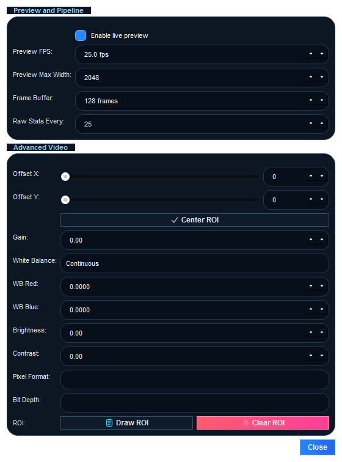
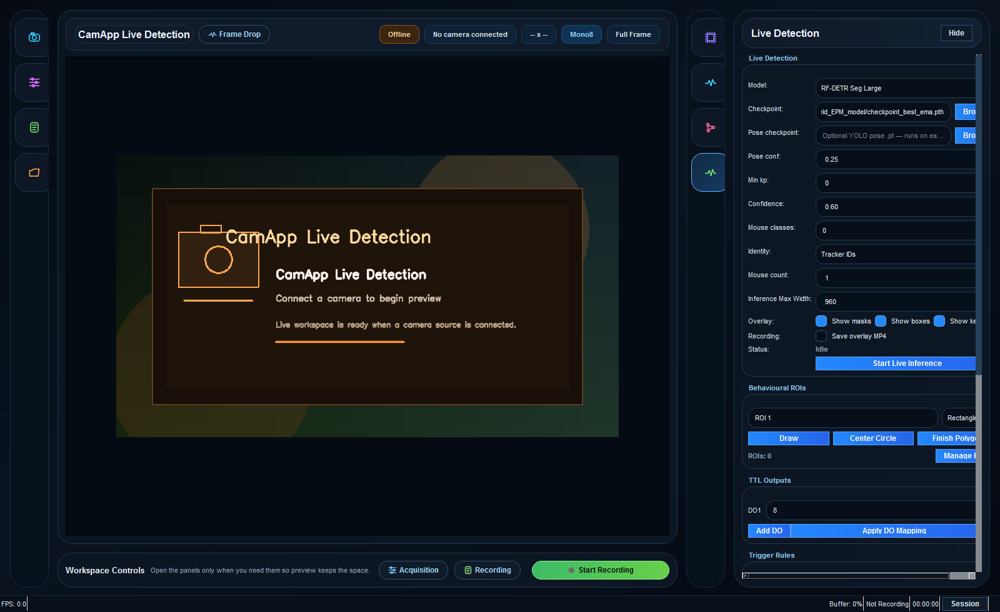

# PyKaboo

<p align="center">
  
</p>

PyKaboo is a Windows desktop app for synchronized camera acquisition, planner-driven recording, live animal detection, and Arduino TTL control. It supports Basler, FLIR, and USB cameras from one interface and keeps the recording workflow tied to a multi-trial session plan.

## Highlights

- Trial planner
- Live view with optional ROI cropping and frame-drop monitoring
- Live detection panel for RF-DETR Seg and YOLO Seg checkpoints
- Arduino TTL outputs, barcode/sync generation, and live behavior plots
- Recording to MP4 with synchronized metadata exports

## Screenshots









## Requirements

- Windows 10 or Windows 11
- Python 3.10 recommended
- `ffmpeg` available on `PATH`
- Camera SDKs when using vendor hardware:
- Basler: Pylon SDK plus `pypylon`
- FLIR machine vision: Spinnaker SDK plus `PySpin`
- FLIR thermal: `flirpy`

## Install

Conda:

```powershell
conda env create -f environment.yml
conda activate CamApp
```

Virtual environment:

```powershell
python -m venv .venv
.\.venv\Scripts\activate
python -m pip install --upgrade pip
python -m pip install -r requirements.txt
```

## Run

```powershell
python main.py
```

## Outputs

Each recording can produce:

- `<name>.mp4`
- `<name>_metadata.csv`
- `<name>_metadata.json`
- `<name>_metadata.txt`
- `<name>_ttl_states.csv`
- `<name>_ttl_counts.csv`
- `<name>_behavior_summary.csv`

## Arduino Setup

PyKaboo supports:

- `StandardFirmata` for generic TTL monitoring and output control
- `StandardFirmataBarcode` for the custom barcode/sync workflow included in [StandardFirmataBarcode](StandardFirmataBarcode)


## Troubleshooting

- `ffmpeg` not found: add FFmpeg to `PATH` and restart the shell
- `PySpin` import errors: use a Spinnaker-compatible wheel and keep `numpy<2`
- No live inference output: verify the checkpoint path and required ML packages are installed
- Vendor camera connection issues: confirm the camera opens in the vendor SDK viewer first
