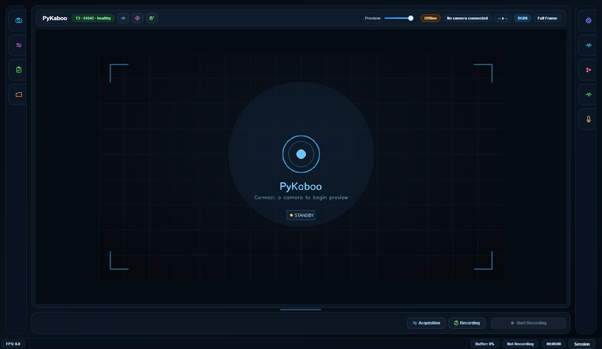
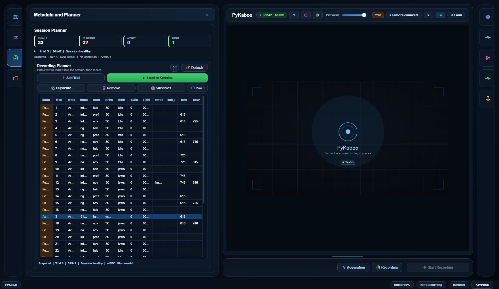
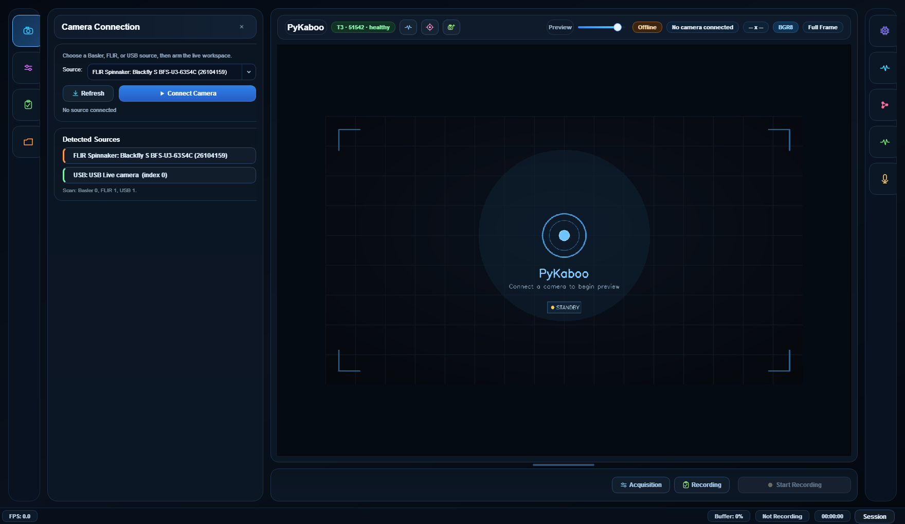
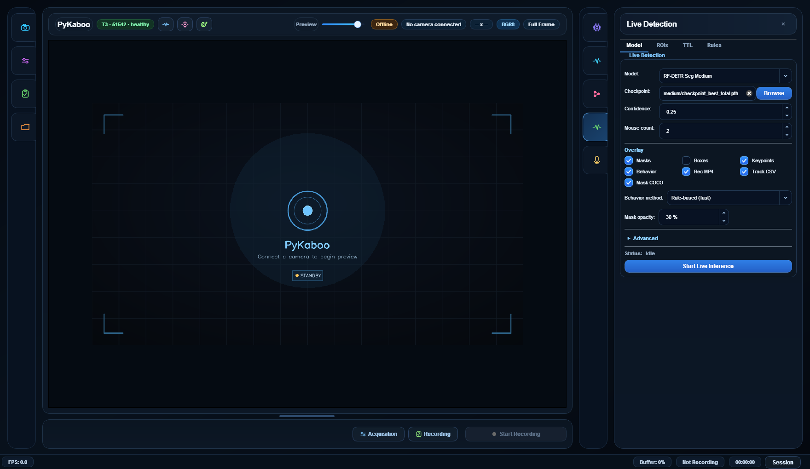
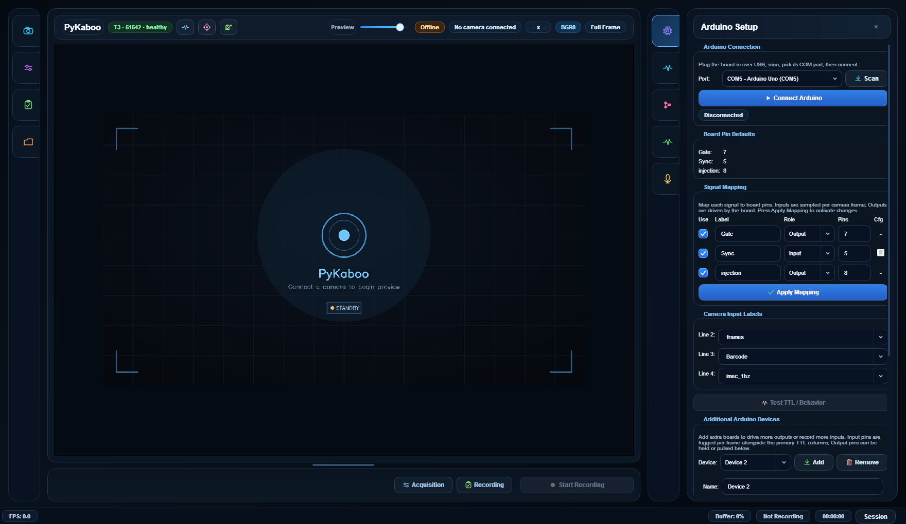
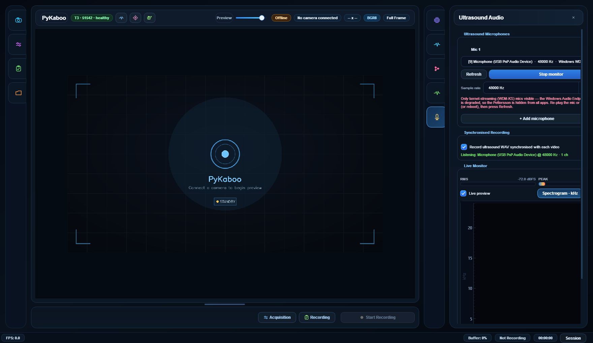
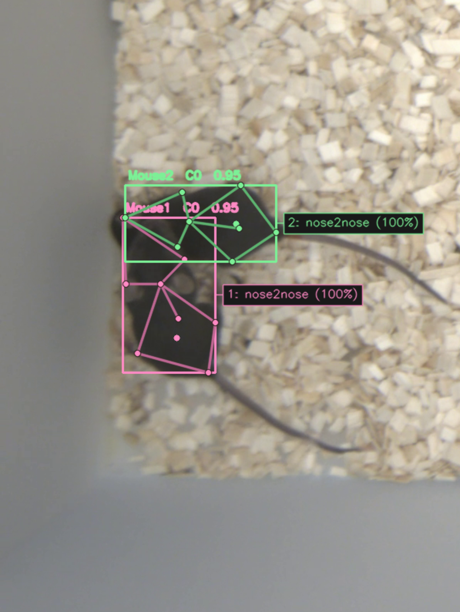
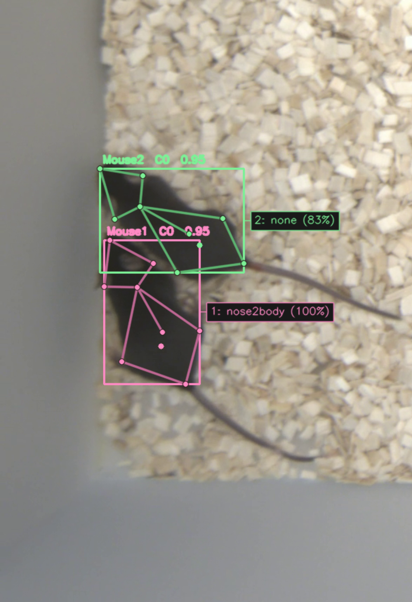

<h1 align="center">PyKaboo 🐭📷</h1>

<p align="center">
  
</p>

<p align="center">
  <b>Point a camera at your mice and... <i>peekaboo!</i></b><br>
  PyKaboo sees them, draws their pose, <b>names what they're doing</b>, and fires your
  TTLs in real time — all from one tidy Windows app.
</p>

<p align="center">
  
  
  
  
  
</p>

---

PyKaboo is a Windows desktop app for **synchronized camera acquisition, planner-driven
recording, live animal detection, and closed-loop Arduino TTL control**. Basler, FLIR,
and USB cameras all live under one interface, and the whole recording workflow stays tied
to a multi-trial session plan so your filenames, metadata, and triggers are always aligned.

It started as a careful acquisition tool. It grew a brain. 🧠


> Every chip is computed **per mouse** (the two directed views of the scene), so you can
> tell who is doing what. The label, the colour, and the connector line all match the
> animal's identity.

## ✨ Highlights

- 🗂️ **Planner-first workflow** — trial rows drive filename, metadata, and recording duration; the planner auto-restores on launch and auto-advances to the next pending trial.
- 🎥 **Many cameras, one window** — Basler, FLIR (machine-vision + thermal), and USB; add up to three auxiliary cameras that all record in sync.
- 🧩 **Live segmentation + pose** — RF-DETR-Seg / YOLO-Seg instance masks with an 8-keypoint skeleton, accelerated with CUDA or TensorRT.
- 🧠 **Live social behavior detection** — detect social behaviors frame-by-frame (see below) and overlay them on the preview *and* the recorded video.
- ⚡ **Closed-loop TTL** — turn a detected behavior (or an ROI / proximity / mask-contact event) into an Arduino pulse for optogenetics and stimulation, in real time.
- 🔊 **Synchronised ultrasound (USV)** — record ultrasonic vocalizations from one or more mics, each WAV time-locked to the video, with a live spectrogram.
- 🧾 **Frame-aligned exports** — MP4 + metadata/TTL/behavior CSVs, all zero-referenced to the first recorded frame so every clock lines up.


Full design notes live in [`pykaboo_live_behavior/INTEGRATION.md`](pykaboo_live_behavior/INTEGRATION.md).

## 🖥️ The interface

PyKaboo keeps you in one place from setup to acquisition — connect hardware, plan trials,
watch the live stream, and record with metadata, audio, and TTLs already aligned. Tools
live in slide-in side panels so the preview keeps the space.

<p align="center">
  
</p>

*The acquisition workspace: a big live preview with health/FPS telemetry up top and
one-click Acquisition / Recording cards along the bottom.*

### 🗂️ Plan the whole session up front

<p align="center">
  
</p>

*The Recording Planner drives everything: each row sets the filename, metadata, and
duration for a trial. Import a CSV or build rows inline; finished trials are marked
`Acquired` and the next pending one is auto-selected.*

### 🎥 Many cameras, one click

<p align="center">
  
</p>

*Basler, FLIR, and USB sources are auto-detected and listed together — here a FLIR
Blackfly and a USB camera. Add up to three auxiliary cameras with the camera button up
top; every connected stream records in sync with one Start Recording.*

### 🧠 Live detection + behavior

<p align="center">
  
</p>

*Pick a segmentation model and mouse count, toggle overlays (masks / boxes / keypoints /
**behavior**), choose the **behavior method** (rule-based or ML), then use the ROIs / TTL /
Rules tabs to draw zones, map DO pins, and arm trigger rules.*

### ⚡ Arduino & TTL control

<p align="center">
  
</p>

*Connect the Firmata board, map signal roles to pins, drive DO1-8 live outputs, generate
barcode/sync, and add extra Arduino devices — every line is logged frame-aligned in the
metadata CSV.*

### 🔊 Synchronised ultrasound (USV)

<p align="center">
  
</p>

*Record ultrasonic vocalizations from one or more mics (Pettersson / USB), each WAV
synchronised to the video, with a live RMS/peak meter and a real-time kHz spectrogram.*

## 🚀 Quick start

## 🎬 See it in action

Two mice, live, on plain bedding — masks, pose skeletons, and a **per-mouse behavior
subtitle** drawn straight onto the video (and burned into the recorded overlay MP4):

<table>
  <tr>
    <td width="33%"></td>
    <td width="33%"></td>

  </tr>
  <tr>
    <td align="center"><b>nose2nose</b> — both heads meet, both chips agree at 100%.</td>
    <td align="center"><b>nose2body</b> — the actor (pink) sniffs the partner's flank; the recipient reads <i>none</i>.</td>

  </tr>
</table>


**Requirements**

- Windows 10 or 11, Python 3.10 recommended
- `ffmpeg` on `PATH`
- Camera SDKs for vendor hardware: Basler (Pylon + `pypylon`), FLIR machine-vision (Spinnaker + `PySpin`), FLIR thermal (`flirpy`)
- An NVIDIA GPU is strongly recommended for live detection (CUDA / TensorRT)

**Install (conda)**

```powershell
conda env create -f environment.yaml
conda activate CamApp
```

**Install (venv)**

```powershell
python -m venv .venv
.\.venv\Scripts\activate
python -m pip install --upgrade pip
python -m pip install -r requirements.txt
```

**Run**

```powershell
python main.py
```

On Windows prefer `run_pykaboo.bat`, which finds a Python runtime that can import
`PySide6`, `cv2`, and `PySpin` (so FLIR cameras don't vanish when launched from the wrong
interpreter, and torch loads in the right DLL order).

## 🗂️ Planner workflow

- Import a CSV plan or build rows directly in the Recording Planner.
- The current planner is saved automatically and restored on the next launch.
- Select a row to load its metadata into the session form.
- `Ctrl+C` / `Ctrl+V` on a row copies trial content onto other rows.
- Right-click rows for duplicate, copy, paste, move up/down, apply, and remove.
- When a trial finishes recording it is marked `Acquired` and the next pending row is selected.

## 📦 Outputs

Each recording can produce:

- `<name>.mp4` and `<name>_overlay.mp4` (masks + pose + behavior subtitles)
- `<name>_metadata.csv` / `.json` / `.txt`
- `<name>_ttl_states.csv`, `<name>_ttl_counts.csv`
- `<name>_live_detections.csv` and `<name>_tracking_dlc.csv` (DLC-style keypoints)
- `<name>_masks_coco.json` (segmentation masks)
- `<name>_behavior_summary.csv`
- `<name>_<backend>_<n>.mp4` (+ metadata) per auxiliary camera

Timestamp columns (`timestamp_software`, `timestamp_camera`, `timestamp_ticks`) are
elapsed seconds starting at 0 on the first recorded frame; `camera_frame_id` is rebased to
0 so it can be compared with `frame_id` to spot dropped frames.

## 🔌 Arduino & TTL

PyKaboo supports:

- `StandardFirmata` for generic TTL monitoring and output control
- `StandardFirmataBarcode` for the custom barcode/sync workflow ([StandardFirmataBarcode](StandardFirmataBarcode))

**Additional Arduino devices:** the primary board (gate/sync/barcode + DO1-8 live outputs)
is unchanged. To drive extra outputs or log extra inputs, use **Additional Arduino
Devices** at the bottom of the Arduino Setup panel — add a board, pick its COM port, and
set each pin to **Input** (sampled per camera frame) or **Output**. Each input/output is
logged as a frame-aligned `dev<id>_<label>_ttl` column in `*_metadata.csv`. Auxiliary
boards must each use their own COM port, and the roster persists between launches.

## 🛠️ Build a Windows EXE

```powershell
python -m pip install -r requirements.txt pyinstaller
.\scripts\build_release.ps1 -Version v2026.04.12 -PythonExe python -Clean
```

See [camApp-live-detection.spec](camApp-live-detection.spec) and
[scripts/build_release.ps1](scripts/build_release.ps1).

## 🧰 Troubleshooting

- **`ffmpeg` not found** — add FFmpeg to `PATH` and restart the shell.
- **`PySpin` import errors** — use a Spinnaker-compatible wheel and keep `numpy<2`.
- **No live inference output** — check the checkpoint path and that the ML/behavior packages are installed; a GPU is strongly recommended.
- **Empty / 1-frame overlay MP4** — fixed: a degenerate detection used to crash the overlay writer; it now skips bad frames and keeps recording.
- **Vendor camera won't connect** — confirm it opens in the vendor SDK viewer first.

---

<p align="center"><i>Made for behavioural neuroscience rigs that need to see, decide, and act — frame by frame.</i></p>
